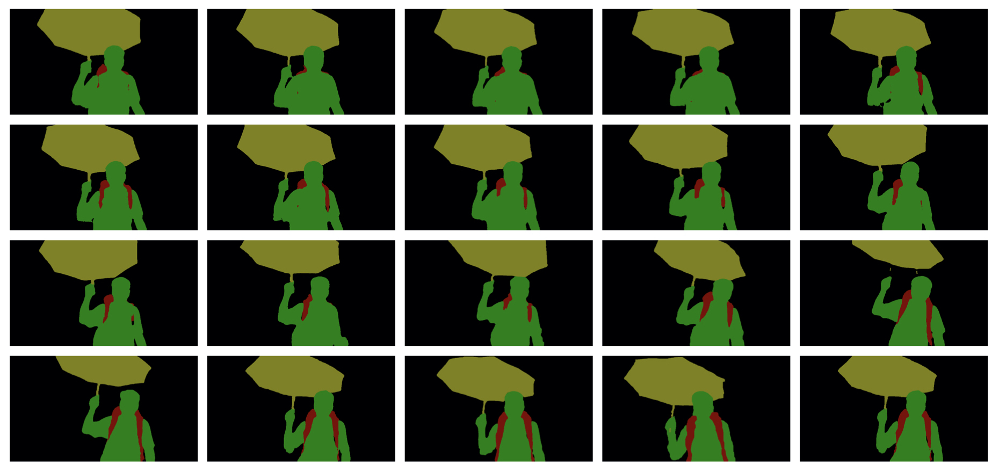
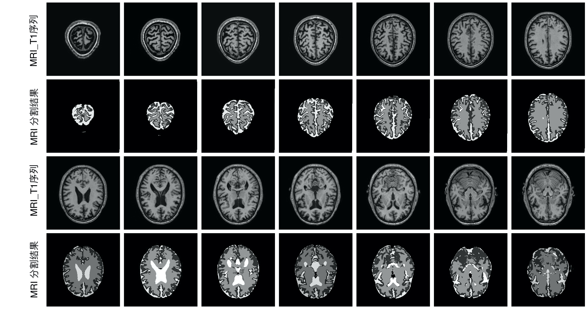

# PReMVOS-mod-for-large-scale-video-object-segmentation
You can find the orginal PReMVOS paper and code [here](https://github.com/JonathonLuiten/PReMVOS)

## PReMVOS modification for large-scale video object segmentation.

It has a good performance on video object segmentation, better fits the large-scale video segmentation and achieved an accuracy of 69%, ranked 9th in the [The 2nd Large-scale Video Object Segmentation Challenge Workshop in conjunction with ICCV2019, Seoul, Korea](https://youtube-vos.org/challenge/2019/)



## Modified Verision in Brain MRI Segmentation


It could be also used in medical area like MRI Segmentaion, and has a satifying performance when segmentation the different tissue in human brain.


## Citation
If you use this code, please consider citing the following papers:

```
@inproceedings{luiten2018premvos,
  title={PReMVOS: Proposal-generation, Refinement and Merging for Video Object Segmentation},
  author={Jonathon Luiten and Paul Voigtlaender and Bastian Leibe},
  booktitle={Asian Conference on Computer Vision},
  year={2018}
}

@article{Luiten18CVPRW,
    author = {Jonathon Luiten and Paul Voigtlaender and Bastian Leibe},
    title = {{PReMVOS: Proposal-generation, Refinement and Merging for the DAVIS Challenge on Video Object  Segmentation 2018}},
    journal = {The 2018 DAVIS Challenge on Video Object Segmentation - CVPR Workshops},
    year = {2018}
}
@article{Luiten18ECCVW,
    author = {Jonathon Luiten and Paul Voigtlaender and Bastian Leibe},
    title = {{PReMVOS: Proposal-generation, Refinement and Merging for the YouTube-VOS Challenge on Video Object Segmentation 2018}},
    journal = {The 1st Large-scale Video Object Segmentation Challenge - ECCV Workshops},
    year = {2018}
}
```
